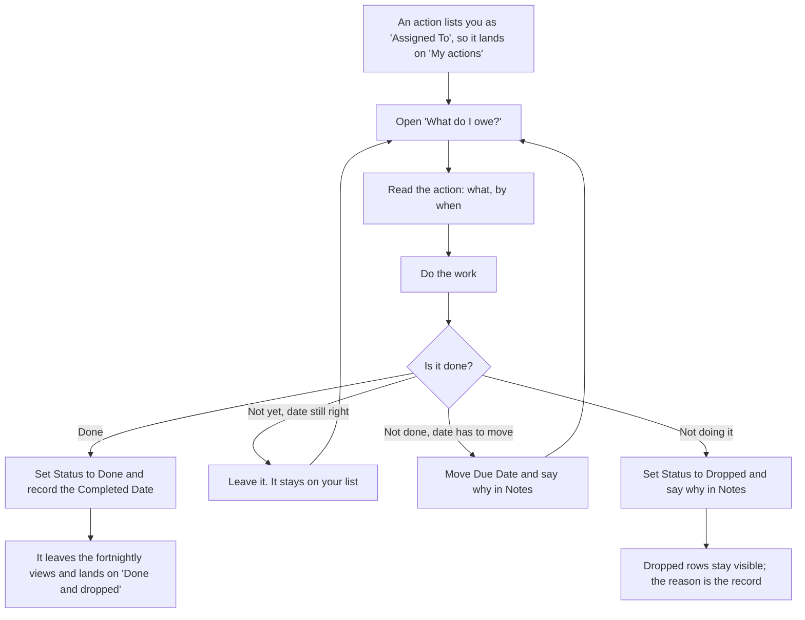

# Complete an action

Work has been handed to you, and your name is on the row. You do it, and
you mark it done in the place that feeds the fortnightly check-in.

**Who:** anyone named **Assigned To** on an action.
**Trigger:** an action lists you as **Assigned To**, so it shows in **My
actions** (a reminder digest is planned for a later phase).

## The process

## The same process, step by step

1. **Trigger.** An action lists you as **Assigned To**, so it shows on **My
   actions** (the "What do I owe?" entry).
2. **You** open **My actions** and read the row: what it asks for, and the
   **Due Date**. **Workstream Phase** shows beside the workstream and is
   read-only; a *Closed* phase means the action is filed against a finished
   workstream. The projection makes that visible rather than preventing it.
3. **You** do the work.
4. **You** record the outcome, one of four ways:
   - **Done** - set **Status** to **Done** and record the **Completed
     Date**. The save rule refuses a Done action with no date, and a second
     rule refuses a completion date in the future.
   - **Still open, date holds** - leave it, or set **Status** to **In
     progress** once you have started. Either way it stays on your list.
   - **Still open, date must move** - move the **Due Date** and write the
     reason in **Notes**.
   - **Not doing it** - set **Status** to **Dropped** and write the reason
     in **Notes**.
5. **The fortnightly check-in** reads **Overdue** first, then **Open by
   person** opened at each person's group. Both show open and in-progress
   work only, so a row you marked Done has already left them.

## The four optional links

Each is blank on ordinary programme work, and each is filled when the
action is not standing on its own.

- **Related Risk** - the risk this action is reducing. Fill it in when the
  action exists because of a risk on the log. It is what makes the risk
  title appear beside the action on **My actions**; a blank in that column
  means nobody set this link, not that no risk exists.
- **Related Issue** - the issue this action was spawned from.
- **Related Service Request** - the service request this action is
  waiting on. This is the one to fill in on the "date must move" branch,
  because without it the request ends up described in **Notes**, where
  nothing can read it.
- **Authorising Decision** - the decision-log entry this action implements.
  Set it when a forum decided something and this action is how it gets
  done. That is the link that makes decide-then-perform countable, and it
  is the far end of `record-a-decision.md`'s pointer.

## How to check it worked

**My actions** shows only open and in-progress work. Once you mark an
action Done or Dropped it leaves that view, which is the confirmation, and
lands on **Done and dropped**, sorted by **Completed Date** with the most
recent first. The **Overdue** view, read first at the fortnightly, catches
anything you let slip past its date.
