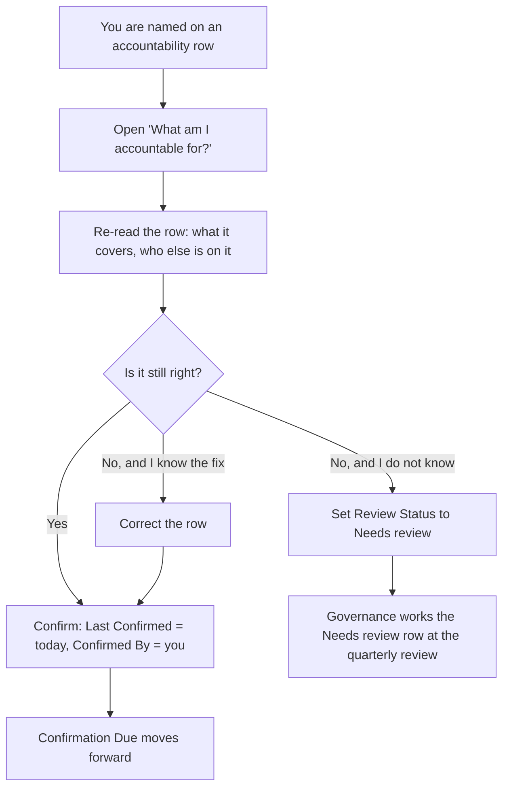

# Confirm your accountability

You are named Responsible or Accountable on an activity. Every quarter -
or sooner, if something changed - you re-read the row and confirm it still
describes reality, or correct it.

**Who:** anyone named **Responsible** or **Accountable** on an activity who
is also in the `GOV Accountability Maintainers` group. Being named grants
nothing on its own: site members hold Read on these lists, so somebody
named on forty activities but outside that group can read every one of them
and confirm none.
**Trigger:** the quarterly review asks, or the work actually changed.

## The process

## The same process, step by step

1. **Trigger.** The quarterly review asks, or the work changed.
2. **You** open **My accountabilities** (the "What am I accountable for?" entry)
   and re-read the row: what it covers, and who else is named.
3. **You** do one of three things:
   - **Still right** - confirm. **Last Confirmed** becomes today and
     **Confirmed By** becomes you. That pair is the confirmation; editing
     any other field on the row is not one, however carefully you read it.
     **Last Confirmed** cannot be a future date.
   - **Wrong, and you know the fix** - correct the row, then confirm it.
     One correction can be refused at save: setting **Activity Kind** to
     Decision, setting **Criticality** to Statutory, or filling **Activity
     Role** all require an **Escalation Route**, and the row will not save
     without one. Fill it in and save again.
   - **Wrong, and you do not know** - set **Review Status** to **Needs
     review** so the quarterly review picks it up.
4. **The system** moves **Confirmation Due** forward by the criticality
   (6, 12 or 24 months). It does this from **Last Confirmed**, so a row
   nobody has ever confirmed has no **Confirmation Due** at all. That is
   the *Never confirmed* view's job, not a fault.
5. **The quarterly review** reads the register and works every **Needs
   review** row - a row should not survive two consecutive reviews.

Two things make this safe rather than a free-for-all:

- You can edit any row in the register because you are a member of the GOV
  Accountability Maintainers group, not because you are named on it - the
  platform cannot restrict editing to the people named on a row. Everything
  is versioned, so a correction is visible, not silent, and the quarterly
  review reads the version history.
- You cannot delete a row or prune its history. The version history is the
  audit, it keeps 200 versions on each of the three accountability lists
  rather than the usual 100, and it is read quarterly. The quarterly read
  has a second half: governance reconciles who is in `GOV Accountability
  Maintainers` against who is currently named Responsible or Accountable,
  because nothing in the deployment keeps those two in step.

## How to check it worked

**My accountabilities** shows your rows and their **Review Status**. Once
you have confirmed a row, a **Confirmation Due** that keeps moving is the
confirmation working; a row that has never been confirmed shows nothing
there and appears on *Never confirmed* instead. A **Needs review** row that
survives two reviews is the failure the quarterly review exists to catch.
