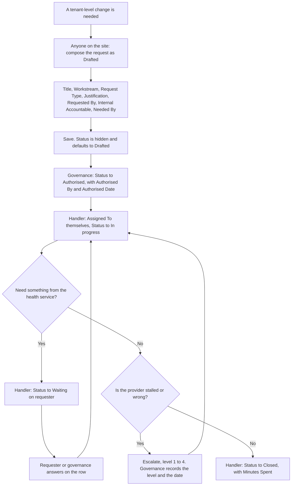

# Raise a service request

A change needs tenant-level rights that only the shared service provider
holds. You compose the request in this site, governance authorises it, a
handler at the provider picks it up and works it here, and it closes here
with the minutes it took. One row, from draft to closure.

**Who:** anyone on the site composes it; governance authorises it; a
handler in `GOV Request Handlers` works and closes it.
**Trigger:** a change is needed that only the provider can make.

## The process

## The same process, step by step

1. **Trigger.** A change needs tenant rights only the provider has.
2. **Anyone on the site** starts a new request. The form asks for
   **Title**, **Workstream**, **Request Type**, **Justification** (why,
   and what it unblocks), **Requested By**, **Internal Accountable**, and
   **Needed By**. **Needed By** is your internal planning date; it commits
   the provider to nothing. **Status**, **Assigned To** and **Minutes
   Spent** are hidden, and Status starts as **Drafted**.
3. **Governance** authorises it: **Status** to **Authorised**, with
   **Authorised By** and **Authorised Date**. A contested or non-routine
   request also names the decision-log entry that authorised it in
   **Authorising Decision**; a routine authorisation leaves that blank.
   Nothing at save can require **Authorised By**, because it is a person
   column and SharePoint validation formulas refuse person operands, so
   the fortnightly read checks that every authorised request names one.
   Governance may name the handler in **Assigned To** here, or leave it to
   the provider.
4. **A handler** picks it up: **Assigned To** to themselves and **Status**
   to **In progress**. Nothing at save can require **Assigned To** either,
   for the same reason, so the fortnightly read checks that every request
   In progress names one.
5. **The handler** works it on the row. If they need something from the
   health service first, **Status** goes to **Waiting on requester** and
   the row stays on the default view until the answer arrives and the
   handler moves it back to **In progress**. Put what is needed on the
   row, so the ask and the answer share one version history.
6. **Somebody escalates** if it stalls, and governance records it. Level 1
   is the programme owner chasing the request, level 2 the digital or IT
   director, level 3 the contract manager under the shared-service
   agreement, level 4 the sponsor or an executive. Levels 3 and 4 are the
   contractual ones counted at the agreement review. **Escalation Level**
   is the high-water mark rather than a history: a request escalated at
   level 1 and later at level 3 keeps only level 3, and the sequence is in
   version history. An escalation must record both the level and the
   **Escalated Date**, and the form will not save one without the other.
7. **The handler** closes it: **Status** to **Closed**, with **Minutes
   Spent** as the running total of whole minutes spent on it. The form
   will not save a closed request without that number, and zero is an
   answer.

**Two halves of one control.** **Status** is hidden on the New form, so a
submitter cannot authorise their own request as they compose it, and site
members hold no edit right on this list, so they cannot come back and
authorise it a moment later either. Neither half works alone. Anyone on the
site may record a request; only governance and the handlers may change one
afterwards, including correcting the submitter's own typo.

Three exceptions worth knowing:

- **The provider started it.** If a handler is already working something
  the programme never composed, governance records it here in the shape it
  arrived in, authorises it, and the handler picks up the row. The record
  exists so the authorisation exists.
- **Authorised but never picked up.** The **Authorised, not yet picked up**
  view is read at the fortnightly: an authorised request nobody holds is
  one the provider is not working, and nothing on their side would notice.
- **Abandoned before it was worked.** Governance sets **Status** to
  **Withdrawn**. That is the ending for a request the programme no longer
  wants or that was overtaken, and it keeps the row and its reasoning
  rather than deleting them.

## How to check it worked

The default view, **In progress**, shows what the provider holds, with the
handler beside each row and anything handed back marked **Waiting on
requester**. A handler opens **My assigned requests** for their own queue.
**"My raised items"** shows every request naming you as **Requested By**,
which is not the same as every request you typed: a lead composing on a
colleague's behalf sees it on the colleague's list, not their own. The
**Escalated** view carries everything at level 1 or above, **Needed soon
or overdue** reads **Needed By**, the only ageing signal the list holds,
and **Closed** totals the minutes spent. The steering group reads the
first two monthly and the contract manager reads the third at the
agreement review.
