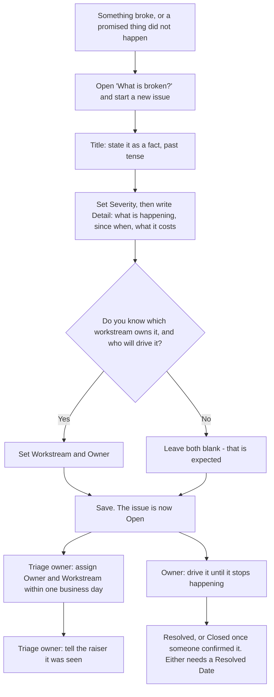

# Raise an issue

Something is broken, or something that should have happened by now has
not. You report it, and someone owns it within one business day.

**Who:** anyone, including someone who has never used a SharePoint list.
**Trigger:** something went wrong, or a promised thing did not arrive.

## The process

## The same process, step by step

1. **Trigger.** Something broke, or a promised thing did not arrive.
2. **Anyone** opens the site and clicks the entry labelled **"What is
   broken?"**. This opens the Issue list.
3. **Anyone** starts a new issue. The **Title** is the fact, not the
   complaint: "The pilot group has not been created", not "IT are slow".
4. **Anyone** sets **Severity** (how much it hurts right now) and writes
   **Detail**: what is happening, since when, and what it is costing.
5. **Anyone** answers the workstream and owner question. If you do not
   know which workstream owns it or who will drive it, leave both blank.
   The form saves without them.
6. **The system** saves the row as **Open**, with today as the raised
   date.
7. **The triage owner** sees it on the **Needs triage** view (issues with
   no owner or workstream), assigns both, and tells you it was seen - all
   within one business day.
8. **The owner** drives the issue until it stops happening, then sets
   **Status** to **Resolved**, or to **Closed** once someone has confirmed
   it is gone. Either status needs a **Resolved Date** and the form will
   not save without one.

**Related Risk** is optional and is the honest one to fill in. If the issue
is a risk from the risk log that has actually happened, name that risk
there; `manage-a-risk.md` step 7 is the other end of the same link. Leave
it blank for anything that was never on the risk log.

## How to check it worked

Open **"My raised items"** on the Issue list. It shows every issue
you created and where each one is now. If nothing has changed within a
business day, ask the triage owner, or the programme owner if the triage
owner is the one who has gone quiet.
