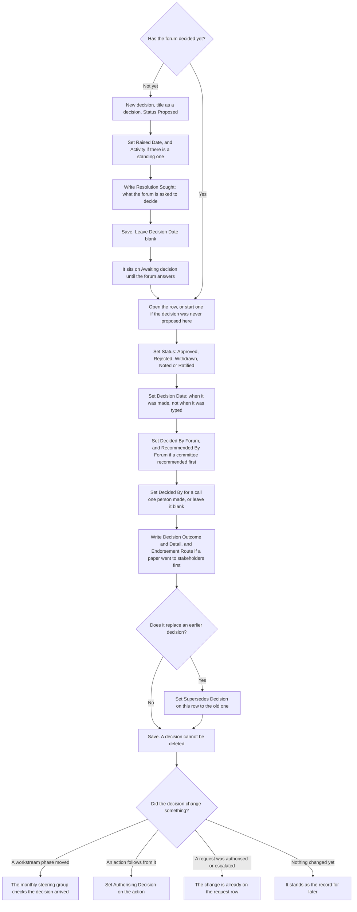

# Record a decision

Either a forum has to decide something, or it already has. Both are rows on
the same list, separated by **Status**, because the whole point of the log is
that it survives and nobody reopens a settled question in six months.

**Who:** governance, or whoever was in the room when it was made.
**Trigger:** something needs deciding, or a decision was made at a meeting,
by governance, or because a workstream phase changed.

## The process

## The same process, step by step

### Putting something to a forum

1. **Trigger.** Something needs deciding and the forum has not met yet.
2. **Whoever is asking** starts a decision. The **Title** states it as a
   decision, not as a topic: "We will run the telephony pilot with one
   directorate only".
3. **Status** stays *Proposed*, and **Raised Date** fills with today.
4. **They** set **Activity** where the proposal belongs to a standing
   activity, which is what says where it should be decided. The route
   stays on the activity and is not copied onto this row, so comparing the
   forum that decided against the route the activity names is a monthly
   report rather than anything the form knows. Blank is the ordinary case.
5. **They** write **Resolution Sought**: what the forum is being asked to
   decide, in the words the paper uses.
6. **They** leave **Decision Date** blank. The list does not stop you
   typing one, but the only rule is the reverse: a decision that has been
   made needs a date, and it will not accept a future date.
7. **The system** shows it on *Awaiting decision*, oldest first, until
   somebody answers it.

### Recording what was decided

1. **Trigger.** A decision was made.
2. **Whoever was there** opens the proposal, or starts a new row when the
   decision was never proposed on the list. A decision typed up after the
   fact is still worth recording, and **Resolution Sought** stays blank.
   **Raised Date** defaults to today, so on a new row set it back to when
   the matter was actually raised; left alone it lands after the decision
   date, which reads as a decision made before it was raised.
3. **They** set **Status**. *Approved* and *Rejected* mean the forum
   decided. *Ratified* means somebody decided under delegation and the forum
   validated it afterwards. *Noted* means no decision was required.
   *Withdrawn* means it came off the table before anybody decided.
4. **They** set **Decision Date** to when it was actually made, not when it
   was typed in. Anything but *Proposed* and *Withdrawn* needs one, and the
   save rule says so.
5. **They** set **Decided By Forum**, and **Recommended By Forum** where a
   committee recommended before the deciding forum approved.
6. **They** set **Decided By** to the person who made the call, or leave it
   blank when a group decided.
7. **They** write **Decision Outcome**, which is what was decided, and
   **Detail**, which is the context, the options considered, and who
   disagreed. Outcome stays separate from Resolution Sought so an amendment
   does not overwrite what was asked.
8. **They** fill **Endorsement Route** where a paper went to stakeholders before
   the forum decided: which stakeholders saw it, in what role, when, and any
   stakeholder that declined or did not respond, with a pointer to where each
   endorsement is recorded (minutes, email, the register). Prose is fine;
   it is read back as evidence, and it lives on the item form only, so it
   appears in no view. If it is not written here it is nowhere.
9. **They** set **Supersedes Decision** when this decision replaces an
   earlier one. Superseding is a new row pointing back at the old one, not
   a rewrite of the old one, and the pointer goes on the new row. Leave it
   blank when nothing is being replaced. The *Decision log* view renders it
   as a column, so a supersession is visible while reading the log.
10. **The system** keeps it: nobody short of a list administrator can
    delete from this list, and version history shows every later rewrite.

Three of the changes a decision can drive are checked, not just recorded:

- A **workstream phase change** must arrive with a decision. The monthly
  steering group compares the workstream's version history against the
  decisions dated in that window.
- An **action that implements a decision** names it in **Authorising
  Decision**, which is what makes decide-then-perform countable.
- A **service request authorisation** and an **escalation** are the decision
  in action. The request row names who did them and when, and a contested
  or non-routine authorisation also names this decision in the request's
  own **Authorising Decision**. A routine authorisation leaves it blank.

## The monthly check

### The phase pair

Two checks, read at the steering group, that fail in opposite directions.

1. **A phase change with no decision.** The workstream moved and nothing on
   the decision log accounts for it. Either the decision was made and never
   typed, which is the discipline lapsing, or the phase was changed by
   somebody who had not been given the call.
2. **A phase change with an unresolved proposal.** The workstream moved
   while a proposal about it is still *Proposed*. That is worse than the
   first case: the forum was asked, has not answered, and the programme
   proceeded anyway. Read *Awaiting decision* beside the workstream history
   rather than after it.

### The three reconciliations

The same meeting reads *Awaiting decision* and the three reconciliations
set out in `50-govern/reporting-joins.md`: route against outcome, recommend
then decide, and decide then perform. The headline one is the first, that
the forum which decided was the forum entitled to decide. **No save rule
can make that check.** It compares two lookups across two lists, which a
SharePoint validation formula cannot read, so it is a monthly report and a
row it flags is a question rather than an error.

## How to check it worked

*Awaiting decision* is the queue and is what the list opens on, and it is
read at the fortnightly along with decisions made that day. *Decision log*
is everything answered, and it is the monthly read, through the three
reconciliations above. *Stalled proposals* is anything raised more than 42
days ago and still unanswered, which is two monthly cycles missed.

*Changed since last review* is the read that makes version history a
control rather than a fact about the platform. It renders Modified and
Editor, most recent first, and this list is one of the five on the
quarterly version-history read, because a decision here can be rewritten
and the rewrite is visible only in its history.

If a decision has no row, it did not happen as far as the programme is
concerned. If a proposal has no answer, the forum has not decided, whatever
anybody remembers.
