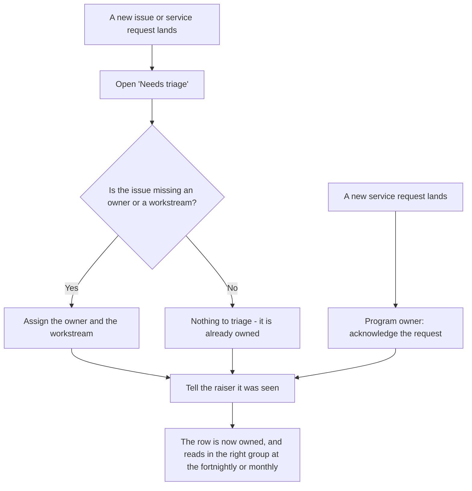

# Triage incoming work

New issues and service requests arrive with gaps the raiser could not fill.
You fill them within one business day, and tell the person it was seen.
This is phase 1's whole acknowledgement.

**Who:** the triage owner (for issues) and the programme owner (for service
requests).
**Trigger:** daily, or when something new lands with a gap.

## The process

## The same process, step by step

1. **Trigger.** A new issue or service request lands, or it is time for the
   daily pass.
2. **The triage owner** opens **Needs triage** on the Issue list:
   every issue with a blank **Owner** or a blank **Workstream**, whatever
   its status. The view carries no status filter, so an issue that was
   resolved without ever being triaged stays in the queue.
3. **The triage owner** assigns both fields. The issue was already on the
   fortnightly read, which filters on status alone; what triage does is put
   it in the right workstream group with a named owner beside it.
4. **The triage owner** tells the raiser it was seen - the response target
   is one business day.
5. **The programme owner** does the same for new service requests: confirms
   the request was seen, so a first-time raiser is not left waiting on a
   record.

Two facts that keep this light:

- An issue with no owner or workstream is not a mistake - it is the
  expected shape of a report from someone who knows what broke but not
  which workstream owns it. The blank is the signal, not the defect.
- **Needs triage** is a view, not a list. There is no separate triage
  register to reconcile; you are filling in the one existing issue row.

## How to check it worked

**Needs triage** should trend toward empty. If the same row sits there past
a business day, the acknowledgement is the thing that failed - the fortnightly
read's opening two minutes is the fallback, not the plan.
