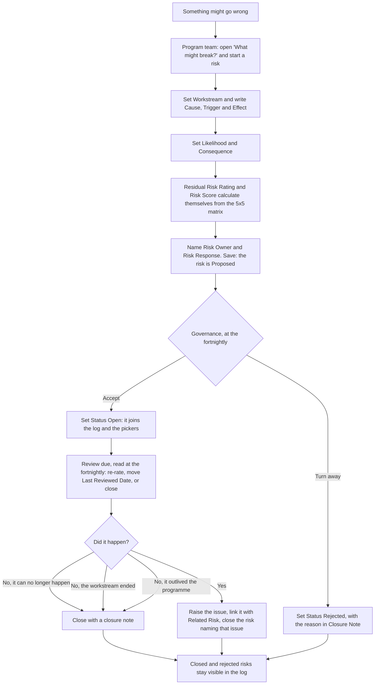

# Manage a risk

Something might go wrong. The programme team proposes it, rated on the 5x5
matrix; governance opens it onto the log or rejects it; the owner reviews it
on its cadence and closes it with a reason, or lets it become an issue.

**Who:** the programme team. An occasional user who thinks something might
go wrong tells the triage owner, who passes it to the programme team to create
and rate.
**Trigger:** an uncertain event that could hurt the programme.

## The process

## The same process, step by step

1. **Trigger.** An uncertain event could hurt the programme.
2. **The programme team** opens the entry labelled **"What might break?"**,
   which is the Risk list, and starts a risk. The **Title** states
   the uncertain event, not the outcome: "The provider does not create the
   pilot group before the pilot starts".
3. **The team** sets **Workstream** and writes **Cause** (the condition
   already true), **Trigger** (the event that would turn it into a
   problem) and **Effect** (what it does to the programme).
4. **The team** sets **Likelihood** and **Consequence**. **Residual Risk
   Rating** and **Risk Score** calculate themselves from the matrix - there
   is nowhere to type a rating that disagrees with it.
5. **The team** names the **Risk Owner** and the **Risk Response**. A
   **Tolerate** response is always for a set period and belongs in the
   decision log. Setting **Risk Response** to **Tolerate** reveals
   **Tolerance Decision** on the form: a lookup to the decision-log row
   that accepted the risk for that period. Leave it blank for every other
   response. The row saves as **Proposed**.
6. **Governance**, at the fortnightly, reads the **Proposed** view and
   sets each row **Open**, which puts it on the log and in the pickers, or
   **Rejected** with the reason in **Closure Note**. **Next Review Due**
   calculates itself from **Last Reviewed Date** and the rating.
7. **Monthly**, the steering group reads the open risks and each owner
   either re-rates, moves **Last Reviewed Date** to the day of the review,
   or closes.
8. **Closing** takes a **Closure Note** and one of four reasons: it can no
   longer happen, the workstream ended, it happened, or it has outgrown the
   programme and graduates to the organisational risk register. If it
   happened, raise the issue, link it with **Related Risk**, and name that
   issue in the closure note - so the log reads as a chain, not two
   orphaned rows. If it graduates, the closure note names where it went.
   Nothing refuses a save here: a closure note is rich text, and a
   SharePoint validation formula cannot read a multi-line column at all.

## How to check it worked

The **Proposed** view is the fortnightly intake, oldest first: a proposal
nobody answers is the same failure as a stalled decision. The **Open** view
(sorted by score) is the monthly read. The **Review due** view is the
fortnightly nudge. **Closed this quarter** is the closure-note check for
closed and rejected risks alike, read monthly at the steering group because
nothing at save can make it: every closed or rejected risk must say why, and
a blank is visible while reading.
